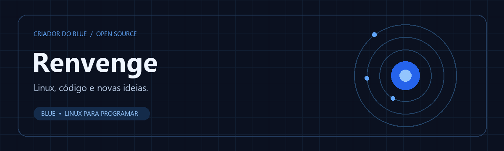

  

  <b>Transformando ideias em projetos que você pode explorar.</b> 
  Linux · Python · Ferramentas para programação

  
  

## Olá, eu sou Renvenge

Sou o criador do **Blue**, uma distribuição Linux leve baseada no Debian e voltada à programação. Meu foco no projeto é tornar o ambiente de desenvolvimento simples, acessível e pronto para explorar novas ideias.

O Blue é desenvolvido com apoio de ferramentas de IA, com proposta e direção definidas por mim e respeito aos créditos e às licenças dos componentes utilizados.

## Projeto em destaque

### 🔵 [Blue — Linux leve para quem programa](https://github.com/Renvenge/Blue)

Um ambiente com identidade própria, ferramentas de desenvolvimento e espaço para experimentar.

| Base | Experiência | Desenvolvimento |
| :--- | :--- | :--- |
| Debian e Linux | Desktop leve, tema escuro e persistência | Python, Git e ferramentas para programação |

→ [Explorar o projeto](https://github.com/Renvenge/Blue) · [Ver versões](https://github.com/Renvenge/Blue/releases) · [Sugerir uma melhoria](https://github.com/Renvenge/Blue/issues)

## Tecnologias presentes no Blue

  
  
  
  
  

## Vamos construir

Sugestões, relatos de uso e contribuições são bem-vindos. Acompanhe o [Blue](https://github.com/Renvenge/Blue) ou abra uma [discussão por issue](https://github.com/Renvenge/Blue/issues).

---

Renvenge · Ideias em movimento. Código em evolução.

